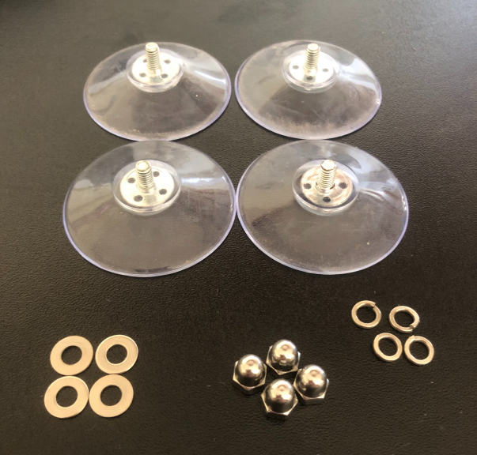
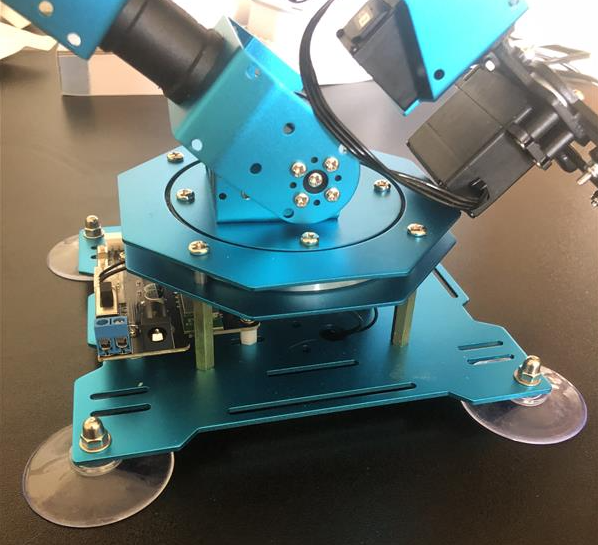
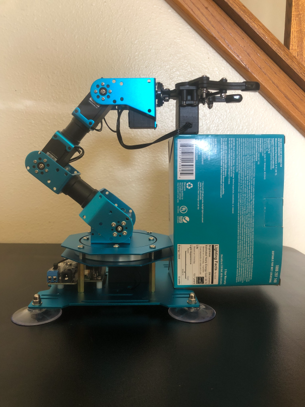
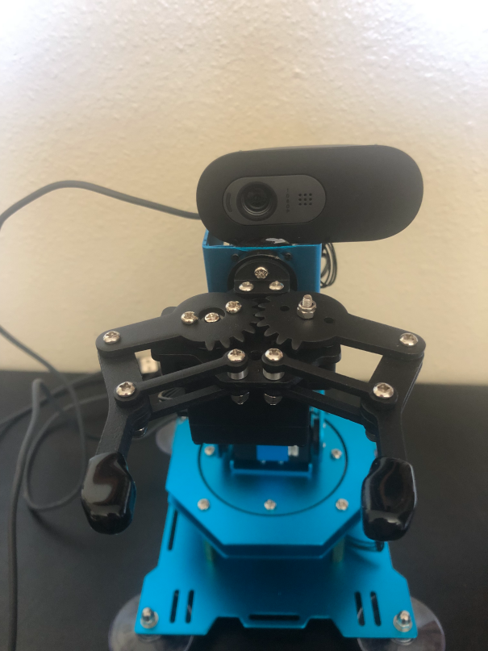
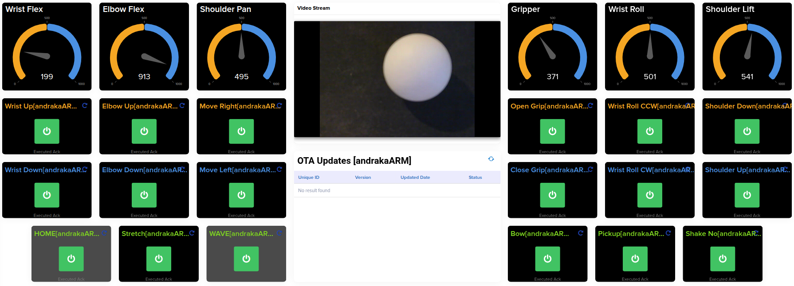

# Tria VisionAI Kit 6490 + /IOTCONNECT — XArm Vision Demos

Three independent vision-driven robotic-arm demos that all run on the same
**Tria VisionAI Kit 6490** (Qualcomm QCS6490 SoC) board and stream telemetry +
accept remote commands through **/IOTCONNECT**. Each demo highlights a
different rung of perception sophistication on the same hardware:

```
   1. ASL gesture control          MediaPipe + PointNet          CPU
   2. HSV pick-and-place           Classical CV (OpenCV)         CPU
   3. YOLO + depth pick-and-place  Custom YOLOv8n + MiDaS-V2    Hexagon NPU
```

The progression is the demo: same arm, same camera, same cloud platform —
showing classical CV vs. NPU-accelerated deep learning side by side.

> [!TIP]
> It is strongly recommended that users complete the [/IOTCONNECT basic quickstart guide for the TRIA VISION AI-KIT 6490](https://github.com/avnet-iotconnect/iotc-python-lite-sdk-demos/tree/main/tria-vision-ai-kit-6490)
> so they can familiarize themselves with the hardware and the /IOTCONNECT UI before proceeding on to this project.

---

## Hardware Requirements

### Included with **[TRIA Vision AI-KIT 6490](https://www.newark.com/avnet/sm2-sk-qcs6490-ep6-kit001/dev-kit-64bit-arm-cortex-a55-a78/dp/51AM9843)**
- USB-C Cable for flashing and USB-ADB debug (included with kit)
- USB-C 12VDC Power Supply and Cable (included with kit)

### Purchased Separately
- **[Hiwonder xArm 1S](https://www.amazon.com/LewanSoul-Programmable-Feedback-Parameter-Programming/dp/B0CHY63V9P?th=1)** — 6-DOF arm + gripper, USB
- Ethernet Cable
- **USB camera** — mounted on the wrist roll servo for demos #2/#3 (eye-in-hand);
  any operator-facing USB camera for demo #1. The reference build uses a
  Logitech Brio 100; any UVC camera works.

> [!TIP]
> If possible, it is recommended to use a bare USB-camera PCB module mounted directly
> behind the gripper jaws, giving the cleanest line of sight to whatever the gripper
> is about to grab and removing the parallax that makes the camera-gripper offset
> calibration necessary.

- USB Mouse and Keyboard
- HDMI Monitor with **active** mini-DP to HDMI adapter
- One practice ball (Nerf Rival Ammo balls work well — small, matte, compress
  slightly inside the gripper)
- A target drop box (any small container in a distinct color, e.g. blue) — for
  demo #2 pickplace and demo #3

> [!IMPORTANT]
> The mini-DP to HDMI adapter must be **active**. To avoid purchasing the wrong
> product it is recommended to use the adapter tested by Avnet's engineer,
> available [here](https://www.amazon.com/Cable-Matters-DisplayPort-Supporting-Technology/dp/B00PJ3LSIG/).

---

## Hardware Assembly

### Hiwonder XArm 1S Robotic Arm Setup

> [!NOTE]
> It is assumed that users have purchased the pre-assembled version of the robotic
> arm. If not, follow Hiwonder's assembly instructions first and then return here.

1. Attach the included suction-cup feet to the base of the arm using the provided
   hardware as shown below:





2. Using a strong adhesive (epoxy works well), attach your USB camera to the top of
   the wrist ("hand") rotational servo motor.

> [!TIP]
> Prop up the arm with a small box (see image below) and use masking tape to hold
> the camera in position while the adhesive sets. A "helping hand" soldering arm
> can also hold the USB cable of the camera for added stability.



> [!IMPORTANT]
> Ensure no adhesive drips down into any joints or moving parts.

3. After the adhesive has cured, the final camera mounting should look like this:



### TRIA Vision AI Kit 6490 Hardware Setup

- Connect 12 VDC USB-C power supply to the USB-C "DC PWR" connector
- Connect ethernet cable to the board's ethernet port
- Connect USB mouse and keyboard to USB-A ports
- Connect a second USB-C cable for USB-ADB communication
- Connect the USB camera

---

## First-Time Setup

> [!NOTE]
> These steps only need to be performed once. After completing them, see
> [Starting the Demo](#starting-the-demo) for the commands to run after
> every reboot.

### 1. Board Bring-Up

1. **Power On**: Hold the S1 button for 2–3 seconds until the red LED turns off.
2. **SSH into the board**:
   ```bash
   ssh root@<board-ip>
   ```
   Login with password `oelinux123`.

### 2. Clone + Python Environment

```bash
git clone https://github.com/avnet-iotconnect/iotc-tria-vision-ai-kit-robotic-arm.git
cd iotc-tria-vision-ai-kit-robotic-arm
```

Install Miniforge (conda) — download and run the installer:
```bash
wget "https://github.com/conda-forge/miniforge/releases/latest/download/Miniforge3-$(uname)-$(uname -m).sh"
bash Miniforge3-$(uname)-$(uname -m).sh
```

Respond to each prompt as follows:
- **License agreement**: Press **ENTER** to scroll through, then type `yes` and **ENTER** to accept.
- **Installation location**: Press **ENTER** to confirm the default path.
- **Shell initialization**: Type `yes` and **ENTER** when asked `Proceed with initialization?`

Reload your shell so `conda` becomes available:
```bash
source ~/.bashrc
```

The board's login shell does not source `.bashrc` automatically on reboot. Run
this once to fix that permanently:
```bash
echo '. ~/.bashrc' >> ~/.profile
```

Create the conda environment and install dependencies:
```bash
conda create -y -n iotc-tria-xarm python=3.11 pip
conda activate iotc-tria-xarm
conda install opencv -c conda-forge
python -m pip install -r requirements.txt

# Optional: NPU inference dependency (only for demo #3)
python -m pip install -r requirements-yolo.txt
```

### 3. ASL Model Weights (Demo #1 Only)

The PointNet classifier weights are not bundled in the repo. Download them once:

```bash
sh model/get_model.sh
ls -lh model/point_net_1.pth   # should be ~38–42 MB
```

Demo #1 will refuse to start with a clear error if this file is absent.

### 4. /IOTCONNECT Onboarding

> [!IMPORTANT]
> If you intend to run this demo with the `--webrtc` flag to enable live video
> streaming, the device **must** be created in /IOTCONNECT using the `robarmwebrtc`
> template provided in this repository (`robarmwebrtc-template.json`). During device
> creation you will be prompted to select a **Stream Resource** — choose **WebRTC**.
> The /IOTCONNECT backend provisions a KVS WebRTC signaling channel at device
> creation time and this choice cannot be changed afterward. If your device was
> already created with a different template or the wrong stream resource, you must
> create a new device using the `robarmwebrtc` template. Devices created without
> the `robarmwebrtc` template can still run any demo without the `--webrtc` flag
> and will not be affected.

Follow [this guide](https://github.com/avnet-iotconnect/iotc-python-lite-sdk-demos/blob/main/common/general-guides/UI-ONBOARD.md)
to onboard your TRIA Vision AI Kit 6490 to /IOTCONNECT.

> [!CAUTION]
> In **Step 14** of the onboarding guide, you must run the quickstart script from
> inside the project directory so that the device certificate and config files are
> placed where this demo expects them. Make sure you are in the project directory
> first, then use this command instead of the one shown in the guide:
> ```bash
> wget https://raw.githubusercontent.com/avnet-iotconnect/iotc-python-lite-sdk-demos/refs/heads/main/common/scripts/quickstart.sh && bash ./quickstart.sh
> ```

> [!NOTE]
> The starter `app.py` downloaded by the quickstart script can be disregarded —
> this demo uses `main.py` instead.

Once onboarding is complete, drop the resulting `iotcDeviceConfig.json`,
`device-cert.pem`, and `device-pkey.pem` into the project root. All three demos
will then publish telemetry and accept remote commands automatically.

---

## Starting the Demo

After the board has been set up and rebooted, run these commands each time to
start the demo:

1. **SSH into the board**:
   ```bash
   ssh root@<board-ip>
   ```
   Login with password `oelinux123`.

2. **Activate the environment and launch**:
   ```bash
   source ~/.bashrc
   conda activate iotc-tria-xarm
   cd ~/iotc-tria-vision-ai-kit-robotic-arm
   python3 main.py --webrtc
   ```

   > [!NOTE]
   > The `source ~/.bashrc` line is needed because the board's login shell does not
   > load conda automatically on reboot. It is safe to run every time.

   > [!NOTE]
   > If running over SSH with no monitor connected, add `--headless` to suppress
   > the camera preview window:
   > ```bash
   > python3 main.py --webrtc --headless
   > ```

   > [!NOTE]
   > `--webrtc` enables live video streaming to the /IOTCONNECT portal. To run a
   > specific demo mode, add `--mode <name>` (e.g. `--mode asl`, `--mode ball`,
   > `--mode yolo-pickplace`). Default is `asl`.

---

## Demo 1 — ASL Gesture Control (`--mode asl`)

**Value prop.** Natural human–robot interaction. The operator stands in front of
the camera and signs single-handed ASL letters; the arm responds in real-time.
Demonstrates **on-board hand tracking (MediaPipe) + landmark classification
(PointNet)** with no per-site calibration once the model weights are downloaded.

**Best for:** showing the kit running a useful, end-user-facing AI experience
with no labelled data and no per-site calibration.

### Camera Setup

**Placement.** Use any operator-facing USB UVC camera — not the wrist-mount used
by demos #2 and #3. The wrist-mounted Brio can double as the operator-facing
camera if you re-mount it; a second USB webcam at a typical monitor-top position
also works.

- Distance: 1.5–3 feet from the signing hand.
- Height: shoulder-to-chest level gives the best hand-to-background contrast.
  Avoid angles that put bright ceiling lights directly behind the hand.
- Frame fill: the hand should occupy roughly ¼–⅓ of the frame. MediaPipe Hands
  performs best when the hand is large and centered, not a small blob in a corner.

**Lighting.** Even, diffuse front-lighting works best. Avoid strong backlighting
(operator in front of a bright window) — the hand goes silhouette and MediaPipe
loses landmarks. A neutral, low-clutter background helps recognition.

**Camera index.** The app auto-detects the Brio 100 by kernel device name. For
a different camera, find its index with `v4l2-ctl --list-devices` and pass it
explicitly:
```bash
./start.sh --mode asl --camera N
```

### Running the Demo

```bash
./start.sh --mode asl                                        # local monitor
python3 main.py --mode asl --headless --web-port 8080        # over SSH
```

Watch the live stream at `http://<board-ip>:8080/` if running `--web-port`.

**Startup sequence:**
1. App connects to the xArm and moves to the home/center pose.
2. /IOTCONNECT connects (if certs are in the project root).
3. PointNet loads from `model/point_net_1.pth` (~2–3 seconds).
4. Camera loop starts. The OSD is blank until a hand appears.

**On-screen overlay:**
- `LEFT=<letter>` (top-left, green) — left hand detected, letter classified
- `RIGHT=<letter>` (top-right, red) — right hand detected, letter classified
- `[<action label>]` below the letter — the arm command that will fire
- Hand skeleton wireframe drawn over the detected landmarks

**Gesture mechanic.** A command fires each time the recognized sign **changes**
— not on every frame. This prevents a held gesture from flooding the arm with
repeat commands. To repeat the same action: briefly drop the hand out of frame
(or form a different sign), then re-sign.

**Model coverage.** The PointNet model classifies 24 static ASL letters (A–Y,
excluding J and Z which require motion). Every frame is classified into one of
these 24 letters — only the mapped letters in the table below trigger arm
commands. Unmapped letters appear in the overlay without an action label.

### Gesture Mapping

| Hand | Sign | Arm Action |
|------|------|------------|
| Left | A | Advance (move forward) |
| Left | B | Back up (move backward) |
| Left | L | Left (shoulder pan) |
| Left | R | Right (shoulder pan) |
| Left | U | Up (raise) |
| Left | Y | Down (lower) |
| Left | H | Home (all servos to center) |
| Right | A | Close gripper |
| Right | B | Open gripper |

All other recognized letters display in the overlay but produce no arm action.

> **Direction note.** The physical direction of Advance/Backup/Left/Right depends
> on how the arm is mounted. If the arm moves the wrong way, adjust
> `LEFT_GESTURE_TO_ACTION` in `modes/asl.py` (swap `'advance'`/`'backup'` or
> `'left'`/`'right'`).

### Telemetry — ASL

Sent on every gesture-triggered arm action and every 2 seconds while running.

| Field | Description |
|-------|-------------|
| `state` | `"ASL-Gesture"` (constant) |
| `gripper`, `wrist_roll`, `wrist_flex`, `elbow_flex`, `shoulder_lift`, `shoulder_pan` | Servo positions (0–1000 units) |
| `sysInfo_cpu` | CPU usage + temperature |
| `sysInfo_memory` | RAM usage + temperature |
| `sysInfo_storage` | Disk usage |
| `sysInfo_gpu` | Adreno GPU % (near zero — workload is on CPU) |

If fields are missing from the /IOTCONNECT dashboard, verify they are declared on
the device template — the broker silently drops undeclared attributes.

---

## Demo 2 — HSV Pick-and-Place (`--mode ball` / `--mode pickplace`)

**Value prop.** Fully autonomous pick-and-drop using **purely classical computer
vision** — HSV color thresholding, contour analysis, and a proportional
visual-servo controller. No machine learning, no NPU. Runs fast on CPU, fully
deterministic, easy to debug, and works on any board with OpenCV.

Two flavors:
- `--mode ball` — ball-follow + grab + return home (no drop phase)
- `--mode pickplace` — find the drop box, grab the ball, drop it in the box

**Best for:** a clean baseline showing that classical CV is still viable for
known-color, controlled-lighting tasks — and making the NPU comparison in
demo #3 meaningful.

**Trade-off:** brittle to lighting changes; requires per-site color
recalibration; can't distinguish a colored ball from a similarly-colored
backdrop.

> [!NOTE]
> This demo is intended to showcase the potential capabilities of the TRIA VISION
> AI-KIT in conjunction with robotics and /IOTCONNECT. The consistency of success
> with the ball-follow demo is reliant on camera angle and positioning, lighting,
> calibration, ball position, and surface/room colors. If your setup cannot
> reliably pick up the target ball, tweak the code and calibration sequences until
> successful.

### One-Time Calibration (Per Site / Per Ball / Per Lighting)

Three pieces of calibration data are required. Capture them in order — each
step writes a JSON file the next may depend on.

> **Safety note.** All calibration scripts release all six servo torques so you
> can free-pose the arm to aim the wrist camera. **Always support the arm before
> pressing Enter**, especially on a wall- or ceiling-mounted arm.

#### 2a. Ball HSV Thresholds — `ball_calibrate.py`

Captures the HSV thresholds used for ball segmentation.

> [!IMPORTANT]
> This script opens an interactive preview window that requires a physical display,
> mouse, and keyboard connected directly to the board. It cannot be run over SSH.
> Connect an HDMI monitor, USB mouse, and USB keyboard before running.

```bash
./calibrate.sh
# or:
python3 ball_calibrate.py [--camera N]
```

1. Hold the arm, Enter → torque drops.
2. Click the ball in the live preview. Each click samples a 7×7 HSV patch and
   widens the mask range. The overlay shows what the detector will see.
3. `h` = re-engage torque at current pose; `w` = release again to re-aim.
4. `s` = save → writes `ball_color.json`. `r` = reset samples. `q`/ESC = quit without saving.

> **Tip for white/grey balls:** hue is automatically set to the full range when
> average saturation is below 60. Click 5–10 spots across the ball surface
> including any slightly shadowed areas.

#### 2b. Scan Poses — `teach_pose.py`

Captures the arm poses cycled through during `SCANNING`. Torque is dropped so
you can pose the arm by hand.

```bash
./teach.sh
# or:
python3 teach_pose.py
```

1. Hold the arm, Enter → torque drops.
2. Pose the arm at each of the six positions as prompted. You teach two rows —
   **near** (close to the base) and **far** (maximum comfortable reach) — at
   three pan positions each (left, center, right). The script automatically
   interpolates a third **mid** row halfway between them.

   > [!IMPORTANT]
   > The scan poses are **search positions only**, not grab positions. For each
   > pose, orient the wrist camera **downward so it has a clear view of the table
   > surface** in that region. Keep the gripper well above the table — once a ball
   > is detected and centered, the grab snap will lower the arm automatically.

3. Press `s` + Enter to snapshot each pose. The script prints the servo values
   and tells you which pose to move to next.
4. Press `h` + Enter to re-enable torque while repositioning, then `r` + Enter
   to release torque again before posing.
5. After all six poses are saved the script automatically updates `SCAN_POSES` in
   `modes/ball_follow.py`.

#### 2c. Drop Box HSV Thresholds — `ball_calibrate.py` (Pickplace Only)

```bash
python3 ball_calibrate.py --output box_color.json [--camera N]
```

Same UI as ball-color calibration. Click on the drop box in the live preview.
The pickplace mode reads `box_color.json` to find and approach the drop target.

#### 2d. Camera-Gripper Offset — `calibrate_cam_offset.py` (Optional)

Skip unless the gripper consistently closes next to the ball rather than on it.

```bash
./calibrate_offset.sh
# or:
python3 calibrate_cam_offset.py [--camera N]
```

Uses a two-phase process because the camera cannot see the ball when the wrist
is in grab position:

1. **Phase 1 — Record grab position**: Place the ball on the table. Hold the arm,
   Enter → torque drops. Pose the gripper directly over the ball at grab height.
   Press `g` + Enter. Records all servo positions.

2. **Phase 2 — Record view position**: Tilt the wrist down until the ball appears
   in the live camera view. Hold steady, press `s` + Enter — the script averages
   the last ~30 frames and writes `CAM_GRIPPER_OFFSET_X/Y` and `WRIST_VIEW_OFFSET`
   into `modes/ball_follow.py` automatically.

3. Press `h` + Enter to re-enable torque, `q` + Enter to quit.

### Running the Demo

```bash
# Ball-follow only (no drop phase):
./start.sh --mode ball
python3 main.py --mode ball --headless --web-port 8080

# Pick-and-place (find box, grab, drop):
./start.sh --mode pickplace
python3 main.py --mode pickplace --headless --web-port 8080
```

Watch the live stream at `http://<board-ip>:8080/` if running `--web-port`.

The arm homes, then enters SCANNING. Drop the ball anywhere in the scan
envelope. The arm centers on it, descends until the apparent radius matches
the grab-distance target, closes the gripper, and either returns home (ball
mode) or carries the ball to the taught box position and releases (pickplace
mode). Open the gripper manually or via the `open_gripper` cloud command to
re-arm the cycle.

### State Machine

| State | What It Does | Exit |
|-------|-------------|------|
| `IDLE` | Initial state at launch. Falls through immediately. | → `SCANNING` |
| `SCANNING` | Cycles through `SCAN_POSES` so the camera sweeps the workspace. | Ball detected → `TRACKING` |
| `TRACKING` | P-controller drives `shoulder_pan` + `wrist_flex` to center the ball. | Centered + radius OK → `GRABBING`; ball lost > grace window → `SCANNING` |
| `GRABBING` | Closes the gripper, watches for stall against the ball, then lifts. | → `HOLDING` |
| `HOLDING` | Returns to home (gripper closed) and waits for operator to open it. | Gripper opened → `IDLE` |

`NO_BALL_GRACE_FRAMES` (~5 s at 6 fps) lets the arm hold its pose during brief
detection drop-outs from clipping or HSV flicker, instead of bouncing back to
SCAN every time the ball flickers off for a frame.

### Key Tuning Constants (`modes/ball_follow.py`)

| Constant | Default | Notes |
|----------|---------|-------|
| `PAN_GAIN`, `TILT_GAIN` | — | Servo units commanded per pixel of error. `TILT_GAIN` is higher because wrist_flex fights gravity at extended poses. |
| `PAN_DIR`, `TILT_DIR` | — | Sign flips. Determined by live test — flip from `+1` to `-1` if the arm moves away from the ball instead of toward it. |
| `MIN_TRIM_STEP` | 3 | Floor on non-zero P-controller commands. Bus servos silently ignore commands below ~5 units (static friction). |
| `MIN_TRIM_STEP_PAN` | 18 | Higher floor for shoulder_pan — it carries the entire forearm + wrist + camera, so its static-friction floor is roughly 2× the wrist's. |
| `APPROACH_STEP` | 0 | Per-frame shoulder_lift step during descent. Disabled in table-mount build — the grab snap handles height directly. |
| `MAX_STEP` | 25 | Hard cap on any single-frame servo delta — keeps a large pixel error from snapping the arm. |
| `MOVE_DURATION_MS` | 220 | How long each per-frame move takes. Too short = small commands ignored; too long = loop rate drops. |
| `CENTER_DEADBAND_PX` | 60 | Pixel error inside which the controller stops trimming. Must be ≥ `MIN_TRIM_STEP_PAN × pixels/unit` or the controller will oscillate. |
| `TARGET_RADIUS_PX`, `RADIUS_TOLERANCE` | — | Apparent ball radius (px) meaning "close enough to grab". Tune for your ball + grab height. |
| `CAM_GRIPPER_OFFSET_X/Y` | 0/0 | Aim-point shift in pixels, set by `calibrate_cam_offset.py`. Leave at 0/0 unless you observe a systematic miss. |
| `LIFT_MAX`, `ELBOW_MAX` | — | Safety ceilings during approach so a never-satisfied radius check can't drive the gripper into the table. |
| `NO_BALL_GRACE_FRAMES` | — | Consecutive lost-ball frames before falling back to SCANNING. |
| `SCAN_POSES` | — | Poses cycled while searching. Captured with `teach_pose.py`. |

> **Warning:** `PAN_GAIN`, `TILT_GAIN`, and `MAX_STEP` all scale implicitly with
> camera/loop frame rate — if you change resolution or drop the preview, expect to
> re-tune.

### Telemetry — HSV

Each payload (sent every ~2 s) carries:

| Field | Description |
|-------|-------------|
| `state` | `IDLE` / `SCANNING` / `TRACKING` / `GRABBING` / `HOLDING` |
| `ballTrack.ball_x`, `ball_y`, `ball_r` | Last detected pixel position + radius (0 if not seen) |
| `ballTrack.pan_err`, `tilt_err` | Current centering error in pixels |
| `ballTrack.radius_err` | Apparent-radius error from `TARGET_RADIUS_PX` |
| `ballTrack.velocity_x`, `velocity_y` | Recent ball motion (px/frame) |
| `ballTrack.d_pan`, `d_tilt`, `d_lift`, `d_elbow` | Last commanded servo deltas |
| `ballTrack.is_prediction` | 1 if current bbox is extrapolated, not detected |
| `ballTrack.no_ball_frames` | Consecutive frames without a detection |

### /IOTCONNECT Dashboard



To monitor and control your TRIA Vision AI Kit 6490 Robotic Arm demo with an
interactive dashboard in /IOTCONNECT:

1. Download the [provided dashboard template](robotic_arm_dashboard_export.json)
   from this repo.
2. Click **"Create Dashboard"** in the toolbar at the top of the /IOTCONNECT UI.
3. Select **"Import Dashboard"** and browse to select the downloaded template.
4. Choose `robarmRTC` for the Device Template and then choose your device's
   unique ID for the Device.
5. Name your dashboard as desired.
6. Click **"Save"**.
7. If desired, move or add widgets in the Dashboard Editor screen, then click
   **"Save"** when complete.
8. Use the control buttons in the dashboard to send commands to the arm — adjust
   individual servos, or send complex demo commands (the buttons with green font
   labels along the bottom) to have the arm complete a series of fluid movements.

---

## Demo 3 — YOLO + Depth Pick-and-Place (`--mode yolo-pickplace`)

**Value prop.** The HSV demo, but with **two neural networks running concurrently
on the Hexagon NPU**:

- **YOLOv8n** (custom-trained on the actual ball) replaces the HSV color filter.
  Robust to lighting, partial occlusion, and similar-color backgrounds.
- **MiDaS-V2 monocular depth** replaces the pixel-radius distance proxy. The grab
  gate fires on real relative distance — independent of ball size or camera focus.

Combined NPU load: **~7 ms YOLO + ~5 ms depth per frame** through the QNN TFLite
delegate, leaving the CPU free for the control loop. Live latency, fps, and depth
values stream to /IOTCONNECT as telemetry.

**Best for:** showing the QCS6490 Hexagon NPU doing real, useful AI work that the
CPU-only demo can't — with side-by-side comparison via demo #2.

**Trade-off:** requires a per-site **D_grab teach** (MiDaS depth values are
scene-specific). Also requires a captured + labelled dataset and one-time INT8
TFLite conversion for a custom YOLO model (see
[`CUSTOM_NPU_DETECTOR.md`](CUSTOM_NPU_DETECTOR.md)).

### Per-Site Re-Teaching

Same ball + same arm + new room = a few things need re-teaching. MiDaS depth
values, HSV thresholds for the drop box, and arm-relative scene geometry are all
site-dependent.

| File | Required? | Command |
|------|-----------|---------|
| `grab_depth.json` | **Required at every new site** | `./teach_grab.sh --model model/ball_best.tflite --camera N --web-port 8080` |
| `drop_pose.json` | Only if drop target moved | Send `release_torque`, hand-pose arm, then `hold_pose` + `teach_drop_pose` from cloud |
| `scan_poses.json` | Only if ball staging area moved | `python3 teach_pose.py` |
| `box_color.json` | Only if drop box or lighting changed | `python3 ball_calibrate.py --output box_color.json --camera N` |
| `camera_settings.json` | Only if lighting is very different | Re-run the exposure/WB lock script |

#### Re-Teaching D_grab (Required at Every New Site)

MiDaS depth values are scene-specific — the same physical grab pose can read
100+ units differently across lighting conditions and camera enumerations.

1. Stop any running demo:
   ```bash
   pkill -f yolo_pickplace.py
   ```

2. Run the teach helper:
   ```bash
   ./teach_grab.sh --model model/ball_best.tflite --camera N --web-port 8080
   ```

3. Open `http://<board-ip>:8080/` in a browser to see the wrist camera.

4. **Hold the arm by hand**, press Enter → torque releases. The arm will fall
   under gravity if you let go.

5. Hand-pose the gripper exactly where you want it at the grab moment. The ball
   should sit just below the gripper jaws and be fully visible to the camera.

6. **While still holding the arm**, press `s` + Enter. Captures 20 frames and
   saves the median D as `grab_depth.json`. (The script refuses to save if you
   press `h` first — a locked-arm capture has zero stdev and is useless.)

7. `h` + Enter to lock the pose, then `q` + Enter to quit cleanly.

Sanity check:
```bash
cat grab_depth.json
```
`D_stdev` should be roughly 10–30, **not 0**. If it's 0, redo the snapshot
before pressing `h`.

### Running the Demo

**Option A — unified launcher (recommended, opinionated defaults):**
```bash
./start.sh --mode yolo-pickplace --web-port 8080 2>&1 | tee /tmp/yolo.log
./start.sh --mode yolo-ball --web-port 8080          # ball-follow only
```

**Option B — full CLI control (override model, conf, camera, depth):**
```bash
./start_yolo.sh --model model/ball_best.tflite --depth --conf 0.7 \
                --camera N --headless --web-port 8080 \
                2>&1 | tee /tmp/yolo.log
```

Open `http://<board-ip>:8080/` to watch the live annotated stream. Over SSH
the demo auto-detects there's no display and runs headless automatically.

**Defaults applied by the unified launcher:**

| Setting | Value |
|---------|-------|
| Model | `model/ball_best.tflite` (falls back to `/etc/models/yolox_quantized.tflite`) |
| Confidence | 0.7 for custom model, 0.25 for stock YOLO-X |
| Depth | Enabled if `/etc/models/midas_quantized.tflite` is present |
| Depth gate | Armed if `grab_depth.json` exists; else legacy radius gate |

**Expected startup log:**
```
[yolo] model=ball_best.tflite format=yolov8 nc=1 in=640x640 float32
       NPU=YES (Hexagon HTP via QNN)
[depth] model=midas_quantized.tflite in=256x256 uint8
        NPU=YES (Hexagon HTP via QNN)
[yolo-ball] depth gate ARMED: D_grab=... +/-...
[yolo-pickplace] entering BALL_PHASE...
```

**Live overlay during a pick:**
```
r=152 dx=+4 dy=-122                              ← YOLO bbox + pan/tilt error
center=OK  settle 2/3  (D >= 829, target 860)    ← gate state
D=860 (raw 884)  higher=closer                   ← smoothed and raw depth
NPU: yolo=7.2ms  depth=4.8ms  14 fps             ← live inference perf
```

The grab fires when `center=OK` AND settle reaches 3/3 (`DEPTH_SETTLE_FRAMES`
consecutive in-window frames). Closer-than-taught still counts as OK — the gate
is a floor, not a window.

### Control-Loop Tuning (`modes/yolo_pickplace.py`)

| Constant | Default | Notes |
|----------|---------|-------|
| `PAN_COOLDOWN_MS` | 250 | Minimum gap between shoulder_pan corrections. |
| `CENTERED_LATCH_FRAMES` | 0 | Latch `centered_ok` for N frames after first becoming true. |
| `DEPTH_SETTLE_FRAMES` | 3 | Consecutive in-window depth_ok frames before firing the grab. |
| `D_EWMA_ALPHA` | 0.25 | EWMA smoothing factor for MiDaS depth. Higher → more responsive; lower → heavier smoothing. |
| `DEPTH_TOL_FLOOR` | 20 | Minimum effective gate tolerance — protects against pathologically tight teach captures. |
| `DEPTH_TOL_MULT` | 1.5 | Tolerance multiplier: effective tolerance = `max(FLOOR, MULT × D_stdev_from_teach)`. |

### Telemetry — YOLO

Each `ballTrack` payload (~2 s) carries all HSV-mode fields plus:

| Field | Description |
|-------|-------------|
| `state` | `BALL_PHASE` / `BOX_PHASE` / `SCANNING` / `TRACKING` / `GRABBING` / `HOLDING` |
| `yolo_ms` | Live YOLO inference time on Hexagon HTP |
| `depth_ms` | Live MiDaS inference time on Hexagon HTP |
| `npu_fps` | Effective end-to-end frame rate |
| `depth_at_ball` | Raw D at the ball (single frame) |
| `depth_at_ball_smoothed` | EWMA-smoothed D (what the control law uses) |
| `depth_settle` | Consecutive in-window depth_ok frames (0–3) |
| `D_grab` | Currently-loaded teach value |
| `D_tolerance` | Effective gate width |

Note: `sysInfo_gpu` will stay near zero — the workload is on the Hexagon NPU,
not the Adreno graphics GPU. NPU activity is visible through `yolo_ms` and
`depth_ms`.

---

## Remote Commands (All Modes)

These commands work via /IOTCONNECT regardless of which demo is running:

| Command | Effect |
|---------|--------|
| `home` | Return arm to safe centered pose |
| `open_gripper` | Open the gripper |
| `close_gripper` | Close the gripper |
| `advance` / `backup` | Move arm forward / backward |
| `left` / `right` | Move arm laterally |
| `up` / `down` | Move arm vertically |
| `set_mode mode=<name>` | Switch active demo without restarting (`asl`, `ball`, `pickplace`, `yolo-ball`, `yolo-pickplace`) |
| `set_mode mode=idle` | Stop the running demo; arm + cloud stay connected |
| `calibrate target=<name>` | Launch a browser-UI calibrator (`ball`, `box`, `offset`, `grab_depth`) — open `http://<board-ip>:8000/` |
| `release_torque` | Drop all servo torques for hand-posing |
| `hold_pose` | Re-engage torque at the current pose |
| `teach_scan_pose name=<n>` | Snapshot current arm pose into a named scan slot |
| `camera_setting <name> <value>` | Update a camera setting live (exposure, saturation, etc.) |

---

## Live WebRTC Video Streaming (Optional)

Any demo can stream the wrist-camera feed live to the /IOTCONNECT portal using
AWS Kinesis Video Streams (KVS) WebRTC. This is entirely opt-in and does not
affect vision or arm control when unused.

### Prerequisites

Your device **must** be created in /IOTCONNECT using the `robarmwebrtc` template
(`robarmwebrtc-template.json` in this repo). During device creation, when
prompted to select a **Stream Resource**, choose **WebRTC**. This choice cannot
be changed after device creation — if your device was created with a different
template, create a new one.

### Enabling WebRTC Streaming

Add the `--webrtc` flag when launching any demo:

```bash
python3 main.py --mode ball --webrtc
# or headless over SSH:
python3 main.py --mode asl --webrtc --headless
```

When connected, the stream appears in the /IOTCONNECT portal under your device's
live view. The wrist-camera feed updates at ~15 fps independent of the main
vision loop so arm moves don't stall the stream.

---

## Custom NPU Detector — End-to-End Reproduction

[`CUSTOM_NPU_DETECTOR.md`](CUSTOM_NPU_DETECTOR.md) covers the full pipeline for
retraining the YOLO model from scratch on your own ball: image capture on the
board, HSV auto-labelling, labelImg review, train/val split, Colab YOLOv8n
training, INT8 TFLite export, and NPU deployment. Start there if the bundled
model doesn't recognize your specific ball.

---

## References

### TRIA Vision AI Kit 6490
- [TRIA Vision AI Kit 6490 Setup Guide](https://github.com/avnet-iotconnect/iotc-python-lite-sdk-demos/tree/main/tria-vision-ai-kit-6490) — Complete setup and configuration guide
- [TRIA Vision AI-KIT 6490 Product Page](https://www.newark.com/avnet/sm2-sk-qcs6490-ep6-kit001/dev-kit-64bit-arm-cortex-a55-a78/dp/51AM9843) — Hardware specifications and purchase information
- [TRIA Startup Guide](https://avnet.com/wcm/connect/137a97f1-eb6e-48ba-89a4-40b024558593/Vision+AI-KIT+6490+Startup+Guide+v1.3.pdf?MOD=AJPERES&attachment=true&id=1761931434976) — Hardware setup and cable connections

### /IOTCONNECT
- [/IOTCONNECT Python SDK](https://github.com/avnet-iotconnect/avnet-iotconnect-python-sdk) — /IOTCONNECT Python SDK for cloud connectivity
- [/IOTCONNECT Device Onboarding](https://github.com/avnet-iotconnect/iotc-python-lite-sdk-demos/blob/main/common/general-guides/UI-ONBOARD.md) — Step-by-step device registration guide
- [/IOTCONNECT Platform](https://www.iotconnect.io/) — Enterprise IoT platform information

### Robotics & AI
- [xArm Python Library](https://github.com/xArm-Developer/xArm-Python-SDK) — Official Python SDK for Hiwonder XArm robotic arms
- [ASL MediaPipe + PointNet](https://github.com/AlbertaBeef/asl_mediapipe_pointnet) — ASL gesture recognition using MediaPipe and PointNet
- [Qualcomm AI Hub](https://aihub.qualcomm.com) — Source of the bundled YOLO-X, MiDaS-V2, and other Hexagon-optimized models on this board
